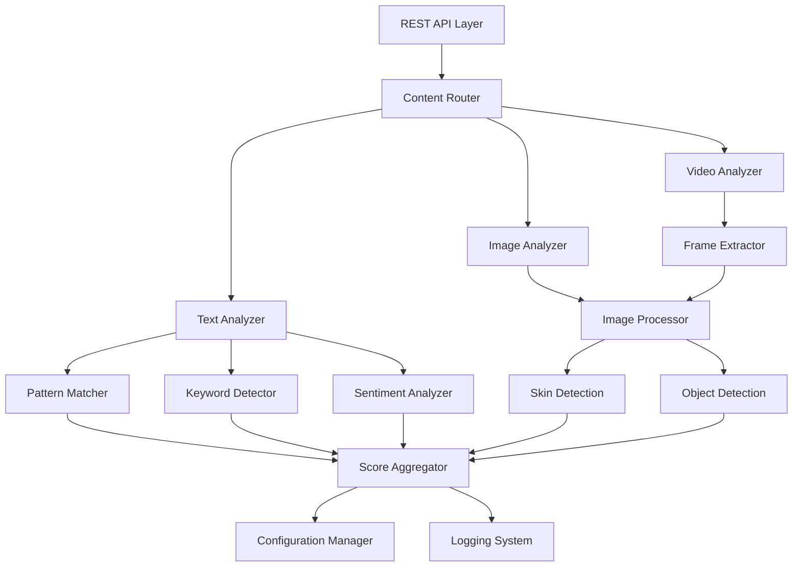

# Content Moderation System Design

## Overview

A self-contained Rust-based content moderation system that uses rule-based algorithms, pattern matching, and traditional computer vision techniques to analyze text and media content. The system operates entirely offline without requiring external AI services or third-party LLMs.

## Architecture

### High-Level Architecture



### Core Components

1. **REST API Layer**: Axum-based web server handling HTTP requests
2. **Content Router**: Routes content to appropriate analyzers
3. **Text Analyzer**: Rule-based text content analysis
4. **Image/Video Analyzer**: Computer vision-based media analysis
5. **Score Aggregator**: Combines individual scores into final results
6. **Configuration Manager**: Handles thresholds and settings
7. **Logging System**: Audit trail and monitoring

## Components and Interfaces

### Text Analysis Engine

**Pattern-Based Detection:**
- Regex patterns for common toxic language
- Dictionary-based keyword matching
- Linguistic rule sets for harassment detection
- Frequency analysis for spam detection

**Sentiment Analysis:**
- Lexicon-based approach using predefined word lists
- Context-aware scoring using surrounding words
- Negation handling and intensity modifiers

**Self-Harm Detection:**
- Curated keyword lists for self-harm indicators
- Pattern matching for crisis language
- Context analysis for severity assessment

### Image Analysis Engine

**Skin Detection Algorithm:**
- HSV color space analysis
- Skin tone classification using statistical models
- Region-based skin percentage calculation
- Texture analysis for context

**Object Detection:**
- Template matching for explicit objects
- Edge detection and shape analysis
- Color histogram analysis
- Geometric pattern recognition

**Content Classification:**
- Rule-based classification using multiple features
- Threshold-based scoring system
- Context-aware adjustments

### Video Analysis Engine

**Frame Sampling:**
- Intelligent frame selection (every N seconds)
- Scene change detection for key frames
- Temporal analysis for motion patterns

**Batch Processing:**
- Parallel frame analysis
- Score aggregation across time
- Peak detection for concerning content

## Data Models

### Core Structures

```rust
#[derive(Debug, Clone, Serialize, Deserialize)]
pub struct ModerationScores {
    pub toxicity: f64,
    pub spam: f64,
    pub hate_speech: f64,
    pub harassment: f64,
    pub adult_content: f64,
    pub violence: f64,
    pub self_harm: f64,
    pub overall_risk: f64,
}

#[derive(Debug, Clone)]
pub struct TextAnalysisResult {
    pub scores: ModerationScores,
    pub detected_patterns: Vec<String>,
    pub confidence: f64,
    pub processing_time: Duration,
}

#[derive(Debug, Clone)]
pub struct ImageAnalysisResult {
    pub nsfw_score: f64,
    pub skin_percentage: f64,
    pub detected_objects: Vec<String>,
    pub confidence: f64,
    pub processing_time: Duration,
}

#[derive(Debug, Clone)]
pub struct VideoAnalysisResult {
    pub nsfw_score: f64,
    pub frames_analyzed: usize,
    pub peak_scores: Vec<f64>,
    pub confidence: f64,
    pub processing_time: Duration,
}
```

### Configuration Models

```rust
#[derive(Debug, Clone, Deserialize)]
pub struct ModerationConfig {
    pub thresholds: ThresholdConfig,
    pub text_analysis: TextAnalysisConfig,
    pub image_analysis: ImageAnalysisConfig,
    pub video_analysis: VideoAnalysisConfig,
}

#[derive(Debug, Clone, Deserialize)]
pub struct ThresholdConfig {
    pub toxicity_threshold: f64,
    pub spam_threshold: f64,
    pub hate_speech_threshold: f64,
    pub harassment_threshold: f64,
    pub adult_content_threshold: f64,
    pub violence_threshold: f64,
    pub self_harm_threshold: f64,
    pub overall_risk_threshold: f64,
}
```

## Algorithm Details

### Text Analysis Algorithms

**Toxicity Detection:**
1. Load predefined toxic word lists with severity weights
2. Apply regex patterns for common toxic expressions
3. Context analysis using surrounding words
4. Calculate weighted score based on matches and context

**Spam Detection:**
1. Repetition analysis (character, word, phrase level)
2. URL and promotional content detection
3. Caps lock ratio analysis
4. Message length and structure analysis

**Hate Speech Detection:**
1. Targeted group keyword detection
2. Slur and derogatory term identification
3. Context-aware severity adjustment
4. Cultural and linguistic pattern matching

**Self-Harm Detection:**
1. Crisis keyword identification
2. Intent analysis through linguistic patterns
3. Severity classification based on directness
4. Context consideration for false positives

### Image Analysis Algorithms

**Skin Detection:**
1. Convert image to HSV color space
2. Apply skin color range filters
3. Morphological operations to reduce noise
4. Calculate skin region percentage
5. Analyze skin region distribution and context

**NSFW Content Detection:**
1. Combine skin detection results
2. Edge detection for body part identification
3. Geometric analysis for explicit poses
4. Color histogram analysis for context
5. Rule-based classification using multiple features

### Video Analysis Algorithms

**Frame Sampling Strategy:**
1. Extract frames at regular intervals (every 2-3 seconds)
2. Detect scene changes for additional key frames
3. Skip similar consecutive frames to optimize processing
4. Ensure minimum and maximum frame limits

**Temporal Analysis:**
1. Analyze each sampled frame using image algorithms
2. Track score trends over time
3. Identify peaks and sustained high-risk periods
4. Weight recent frames more heavily

## Error Handling

### Input Validation
- File format verification
- Size limit enforcement
- Content type validation
- Malformed request handling

### Processing Errors
- Graceful degradation for partial failures
- Timeout handling for long-running operations
- Memory management for large files
- Concurrent processing error isolation

### Response Handling
- Consistent error response format
- Appropriate HTTP status codes
- Detailed error messages for debugging
- Fallback scores for processing failures

## Testing Strategy

### Unit Testing
- Individual algorithm testing with known inputs
- Edge case validation
- Performance benchmarking
- Configuration validation

### Integration Testing
- End-to-end API testing
- Multi-format file processing
- Concurrent request handling
- Error scenario validation

### Performance Testing
- Load testing with various content types
- Memory usage monitoring
- Processing time benchmarks
- Scalability assessment

## Performance Considerations

### Optimization Strategies
- Parallel processing for batch operations
- Efficient image processing with optimized libraries
- Caching for repeated pattern matching
- Memory-mapped file access for large media

### Resource Management
- Configurable thread pools
- Memory limits for large file processing
- Disk space management for temporary files
- CPU usage monitoring and throttling

### Scalability
- Stateless design for horizontal scaling
- Configurable processing limits
- Queue-based processing for high loads
- Health monitoring and auto-recovery

## Security Considerations

### Input Security
- File type validation and sanitization
- Size limits to prevent DoS attacks
- Path traversal prevention
- Content validation before processing

### Data Privacy
- No persistent storage of analyzed content
- Secure temporary file handling
- Audit log data minimization
- Configurable data retention policies

### System Security
- Rate limiting for API endpoints
- Authentication and authorization hooks
- Secure configuration management
- Regular security updates for dependencies